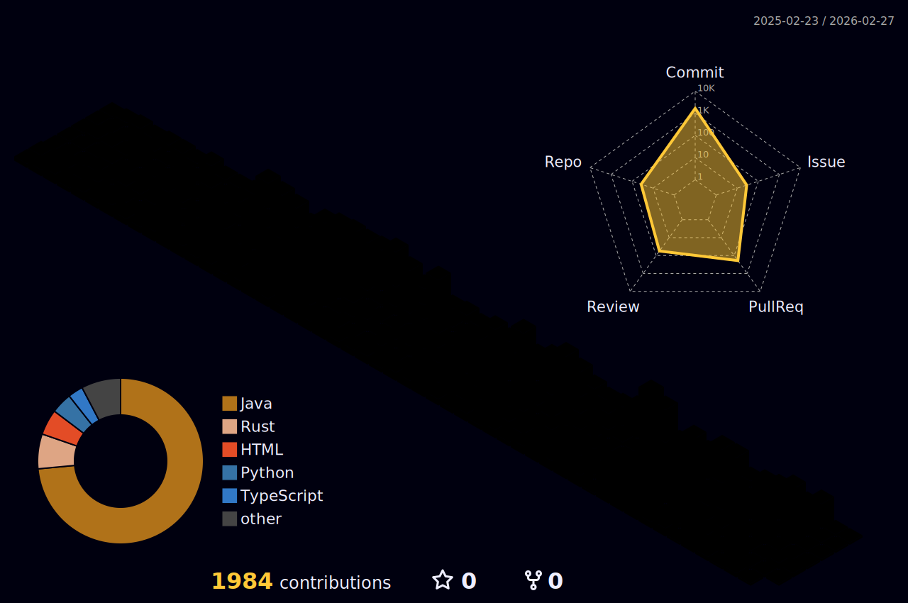

<!-- ✅ 상단: 사진 + 타이핑 + 소개글 (중앙 정렬) -->

  
      <h3>개발이 즐거운 <strong>백엔드 개발자 지망생</strong>입니다.</h3>
     
     
    

  
<h4>🎓 Career & Education</h4>

   
  <table>
  <tr>
    <th>📅 기간</th>
    <th>📌 이력</th>
  </tr>
  <tr>
    <td>2024.01</td>
    <td>📜 [자격증] SQLD</td>
  </tr>
  <tr>
    <td>2024.03~06</td>
    <td>
    🪙 [졸업 작품] 45조 - 시간은행 프로젝트 
    ├─ 수상 : 2024 KMUCS 다학제간 캡스톤디자인 🏆3등상 
    └─ 수상 : LINC 3.0 사업단 커뮤니티 상생센터 성과 공유회 🏆대상
    </td>
  </tr>
  <tr>
    <td>2024.08</td>
    <td>
    🎓 [졸업] 국민대학교 졸업 
    ├─ 제1전공 : 경영학부 
    └─ 제2전공 : 소프트웨어학부 (공학사)
    </td>
  </tr>
  <tr>
    <td>2024.10</td>
    <td>🛠 [자격증] 정보처리기사</td>
  </tr>
  <tr>
    <td>2025.04.01 ~ 2025.10.01</td>
    <td>🏫 [부트캠프] 신한DS SW 아카데미</td>
  </tr>
  <tr>
    <td>2025.10.14 ~ 2025.11.25</td>
    <td>🔥 [우테코] 8기 BE 프리코스 참여</td>
  </tr>
</table>

